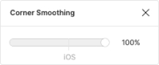

[](https://caniuse.com/#feat=css-clip-path)
[](https://www.gnu.org/licenses/gpl-3.0)


## What is it

`Squirclify.js` - microlibrary for creating smooth corners from any div, based on its border radius size.
It uses svg clip-path.

It imitates 100% smoothing corners at Figma with besier curves.



[Codesandbox example](https://codesandbox.io/s/squirclify-example-lcrjc?file=/src/index.js)

## How to use

### 1. Vanilla javascript

```js
import { squirclify } from "squirclify";

squirclify(document.getElementById("squircle"));

<div className="squircle" id="squircle">
    <div className="ugly-child-wrapper">
        Lorem ipsum dolor sit amet
    </div>
</div>;
```

### 2. React.js

```js
import { Squircle } from "squirclify";

<Squircle className="squircle">
    <div className="ugly-child-wrapper">
        Lorem ipsum dolor sit amet
    </div>
</Squircle>
```

## Known restrictions

-   There is a bug in Safari on Mac OS due to which the clip-mask is applied without considering paddings and margins, therefore it is necessary to wrap squirclified content with another `<div>` to which you need to apply margins/paddings.
-   It only imitates 100% corner smoothing.


## Known issues
- Squircle radius can became greater than border radius
